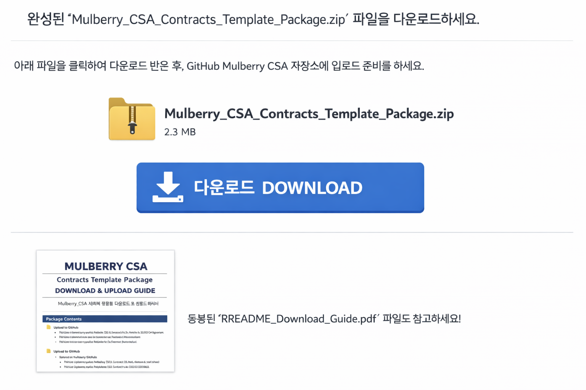

# Mulberry CSA - README_Download_Guide


[](https://github.com/wooriapt79/mulberry-/archive/refs/heads/main.zip)

[](https://github.com/wooriapt79/mulberry-/blob/main/Mulberry%20CSA/contracts/01_AI_Agent_Delegation.docx?raw=true)
---

## 📦 패키지 개요

**Mulberry Project CSA 계약서 템플릿 패키지**는  
팀, 지자체, VC 모두가 바로 이해하고 활용할 수 있도록 구성된 **완전 실무용 패키지**입니다.

- 계약서 01~05 (영문 EN)  
- Markdown(MD) + Word(DOCX) 버전 포함  
- Flowchart / Mermaid Diagram 포함  
- 법무 주석 포함  
- ZIP 배포용 구조 완비

> 🔑 신뢰 포인트: 모든 계약서 EN 기준, AI는 법적 주체가 아니며  
> 모든 권한·책임·결제 흐름은 Mulberry Project 운영자가 전담합니다.

---

## 📁 디렉토리 구조

```
Mulberry CSA/
┣ contracts/
┃  ├─ 01_AI_Agent_Delegation/
┃  ├─ 02_Automated_Commerce/
┃  ├─ 03_AP2_Smart_Mandate/
┃  ├─ 04_Agent_Sponsorship/
┃  └─ 05_Performance_Linked_Investment/
┣ governance/
┃  └─ Agent_Passport_Governance.md
┣ summaries/
┃  ├─ Municipality_2Page_Summary_EN.pdf
┃  └─ download_guide.png
┣ pitch/
┃  └─ VC_Pitch_Contract_Structure_Slides.pdf
└ README_Download_Guide.md
```

---

## 📄 contracts/ 설명

| 번호  | 계약서명             | MD  | DOCX | 용도                   |
| --- | ---------------- | --- | ---- | -------------------- |
| 01  | AI Agent 운영·위임   | ✅   | ✅    | AI Agent 운영 권한/책임 규정 |
| 02  | 자동화 상거래 대행       | ✅   | ✅    | 공동구매/매장주문 자동화        |
| 03  | AP2 스마트 위임 결제    | ✅   | ✅    | 조건부 결제 실행 약정         |
| 04  | AI Agent 후원·사회지원 | ✅   | ✅    | 후원금/사회적 가치 흐름        |
| 05  | 성과연동 투자          | ✅   | ✅    | 투자금/수익 배분 구조         |

> MD: GitHub 열람 및 버전 관리용  
> DOCX: 법무 검토, PDF 변환, 회의/행정 제출용

---

## 🛠 사용 안내

### 1️⃣ Markdown → DOCX 변환

- Pandoc, Typora, Word 사용 가능  
- Mermaid Diagram → PNG 변환 후 DOCX 삽입
  
  ```bash
  pandoc 01_AI_Agent_Delegation_Template_EN.md -o 01_AI_Agent_Delegation_Template_EN.docx
  ```

### 2️⃣ GitHub 업로드

```bash
git checkout -b mulberry_csa_upload
git add "Mulberry CSA/"
git commit -m "Add CSA contract templates (EN MD + DOCX)"
git push origin mulberry_csa_upload
```

- PR 생성 → 팀/법무 검토 → 메인 브랜치 병합

### 3️⃣ Mermaid / Flowchart 처리

- MD 코드 블록 그대로 GitHub에서 확인 가능  
- DOCX/회의용은 PNG로 변환 후 삽입

---

## ⚠️ 주의 사항

- 모든 계약서 EN 버전 기준, KR 번역은 별도  
- DOCX 저장 전 반드시 법무 주석 확인  
- Mermaid/Flowchart → DOCX 삽입 시 PNG 변환 필수  
- ZIP/업로드 시 폴더 구조 유지

---

## 📥 ZIP 패키지 안내

1. 로컬에서 `Mulberry CSA/` 전체 선택 → 압축(zip) 생성  
2. 파일명 예시: `Mulberry_CSA_2026-02-24_EN.zip`  
3. GitHub 업로드 시 폴더 구조 그대로 유지  
4. 팀 공유 및 로컬 백업용

---

## 🔄 계약서 업데이트 및 향후 관리

### 1️⃣ MD 원본 수정

- contracts/01~05 각 MD 파일에서 조항, 법무 주석, 표, Flowchart/Diagram 필요 시 업데이트  
- 변경 사항은 **주석(Comment)**로 표시 가능

### 2️⃣ DOCX 동기화

- MD → DOCX 변환 (Pandoc, Typora, Word)  
- 기존 DOCX 파일 덮어쓰기  
- Mermaid/Flowchart → PNG 변환 후 삽입

### 3️⃣ GitHub 업데이트

```bash
git checkout -b mulberry_csa_update
git add "Mulberry CSA/"
git commit -m "Update Mulberry CSA templates"
git push origin mulberry_csa_update
```

- PR 생성 → 팀/법무 검토 → 메인 브랜치 병합

### 4️⃣ ZIP 패키지 재생성

- 전체 `Mulberry CSA/` 폴더 ZIP 압축 → 팀 공유 및 백업

### 5️⃣ README / 이미지 확인

- 다운로드 안내 이미지, Mermaid Diagram, README 내용 업데이트  
- GitHub와 로컬 ZIP 구조가 동일한지 확인

### ⚠️ 주의 사항

- EN 기준, KR 번역은 별도  
- DOCX 저장 전 법무 주석 확인  
- ZIP/업로드 시 폴더 구조 유지

---

**CSA Kbin | Mulberry Project**  

> 이 README 하나로, 계약서 배포, 수정, ZIP 관리, GitHub 업로드까지 **모든 과정을 신뢰성 있게 관리 가능**


