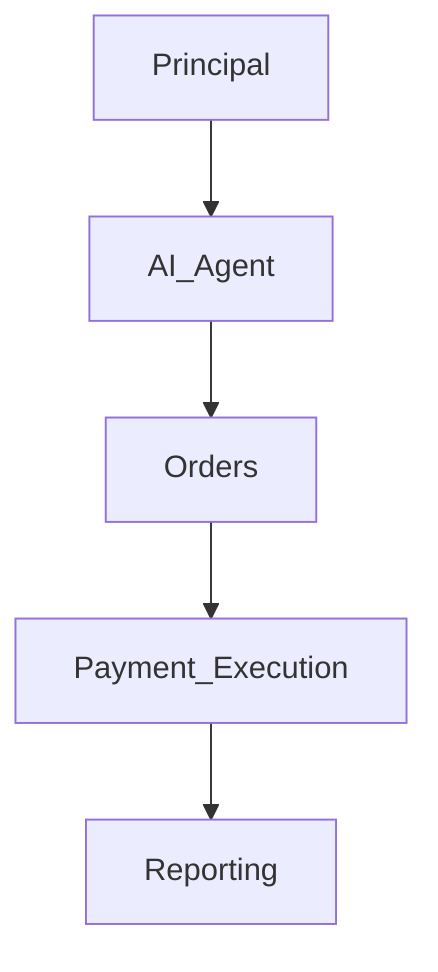

# 01_AI_Agent_Delegation_Template

## 1. Preamble

This Agreement is entered into by and between Mulberry Project (“Principal”) and [Party] (the “Party”), effective as of [Date].

<!-- 목적: AI Agent 운영 위임 및 법적 책임 범위 명확화 -->

## 2. Definitions

- AI Agent: Mulberry Project가 운영하는 자동화 시스템, 법적 주체 아님
- Principal: Mulberry Project
- Party: 운영자/검토자 등 관련 주체

## 3. Scope of Agreement

- Delegation of AI Agent operation
- AI Agent 권한 범위 명시

## 4. Authority & Responsibility Table

| Function         | Responsible Party | Notes                             |
| ---------------- | ----------------- | --------------------------------- |
| Sales Execution  | Principal         | AI Agent acts as tool             |
| Order Processing | Principal         | AI Agent 자동화 지원                   |
| AP2 Payment      | Principal         | Final responsibility on Principal |
| Emergency Stop   | Principal         | Kill switch authority             |

## 5. Operational Workflow

## 6. Liability & Risk

- AI Agent는 법적 주체가 아님
- Principal 책임 명확화

## 7. Compliance

- 규제 준수
- 기록 보존

## 8. Term & Termination

- Start Date ~ End Date
- 계약 위반 시 종료 가능

## 9. Miscellaneous

- 계약 변경은 서면 합의
- 관할권: [Jurisdiction]

## 10. Annexes

- 예시 표
- Flowchart / Mermaid.js Diagram
