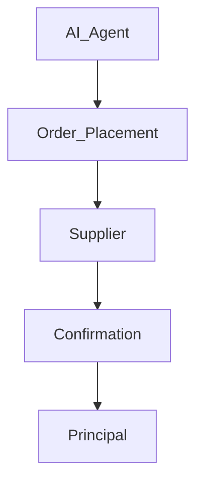

# 02_Automated_Commerce_Template

## 1. Preamble

This Agreement is made between Mulberry Project (“Principal”) and [Supplier/Store] (the “Party”), effective as of [Date].

<!-- 목적: AI Agent를 통한 자동화 주문 및 상거래 대행 정의 -->

## 2. Definitions

- AI Agent: Mulberry Project 운영 자동화 시스템, 법적 주체 아님
- Principal: Mulberry Project
- Party: 상점, 협동조합, 매장 등 공급자
- Order: 공동구매 또는 매장 주문

## 3. Scope of Services

- Automated order placement
- Inventory management support
- Price & discount rules automation

## 4. Order Processing & Automation Rules Table

| Function           | Responsible Party | Notes                                     |
| ------------------ | ----------------- | ----------------------------------------- |
| Order Placement    | Principal         | AI Agent triggers but Principal executes  |
| Stock Verification | Party             | Supplier must update inventory            |
| Discount/Promotion | Principal         | AI Agent applies according to rules       |
| Cancellation       | Party             | Supplier responsible for error correction |

## 5. Operational Workflow

## 6. Data & Reporting

- Data sharing for order fulfillment
- Reporting intervals and format

## 7. Liability & Risk

- AI Agent is not a legal entity
- Principal responsible for automation errors

## 8. Term & Termination

- Contract duration: Start Date ~ End Date
- Termination clauses for breach or operational failure

## 9. Compliance

- Public procurement rules if connected to local government
- Record keeping

## 10. Miscellaneous

- Amendments must be in writing
- Governing law: [Jurisdiction]

## 11. Annexes

- Example tables
- Workflow diagram / Mermaid.js diagram
