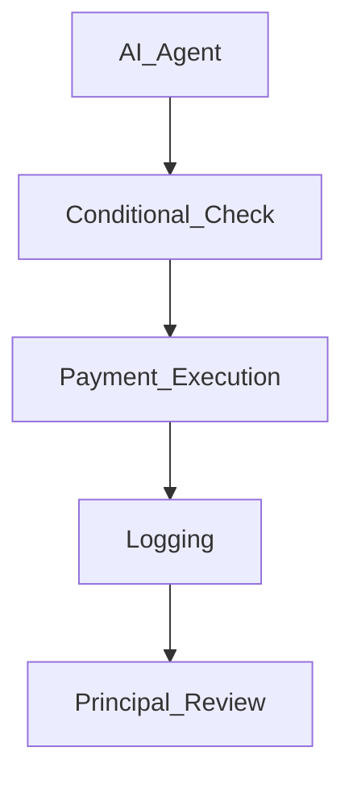

# 03_AP2_Smart_Mandate_Template

## 1. Preamble

This Agreement is entered into between Mulberry Project (“Principal”) and [AP2 Service Provider] (the “Party”), effective as of [Date].

<!-- 목적: AI Agent 기반 조건부 자동 결제 및 책임 범위 명확화 -->

## 2. Definitions

- AI Agent: Mulberry Project가 운영하는 자동화 시스템, 법적 주체 아님
- Principal: Mulberry Project
- Party: AP2 결제 시스템 제공자
- Conditional Payment: 사전에 정의된 조건 충족 시 자동 결제

## 3. Scope of Agreement

- Conditional payment execution by AI Agent
- Approval rules based on Agent Passport / KPI
- Transaction logging and reporting

## 4. Payment Authority & Limits Table

| Function            | Responsible Party | Notes                                                  |
| ------------------- | ----------------- | ------------------------------------------------------ |
| Payment Execution   | Principal         | AI Agent triggers payment, Principal is final approver |
| Approval Conditions | Principal         | Agent Passport score / KPI thresholds                  |
| Payment Limit       | Principal         | Maximum amount per period                              |
| Emergency Stop      | Principal         | Kill switch authority for abnormal transactions        |

## 5. Operational Workflow

## 6. Error Handling & Emergency Procedures

- Non-compliant transactions halted automatically
- Principal notified immediately
- Logs maintained for auditing

## 7. Liability & Risk

- AI Agent is not a legal entity
- Principal assumes responsibility for all executed payments
- Party responsible for system stability, not for AI decision logic

## 8. Compliance

- Financial regulations and reporting requirements
- Data retention and privacy obligations

## 9. Term & Termination

- Effective Date ~ Expiration Date
- Termination on breach or system failure

## 10. Miscellaneous

- Written amendments only
- Governing law: [Jurisdiction]

## 11. Annexes

- Payment rules table
- Flowchart / Mermaid.js Diagram
