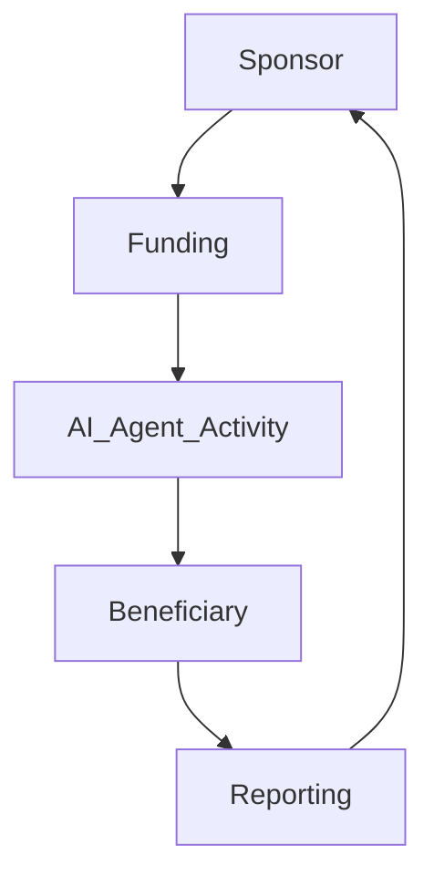

# 04_Agent_Sponsorship_Template

## 1. Preamble

This Agreement is entered into between Mulberry Project (“Principal”) and [Sponsor/Supporter] (the “Party”), effective as of [Date].

<!-- 목적: AI Agent 활동 기반 사회적 가치 후원 및 지원 구조 정의 -->

## 2. Definitions

- AI Agent: Mulberry Project 운영 자동화 시스템, 법적 주체 아님
- Principal: Mulberry Project
- Party: 후원자 또는 사회지원 참여자
- Agent Passport: AI Agent 활동 신뢰 점수 / 성과 지표

## 3. Scope of Agreement

- Sponsorship of social impact activities executed through AI Agent
- Reporting and transparency of AI Agent activities
- Conditional allocation of funds to beneficiaries (e.g., seniors, vulnerable groups)

## 4. Sponsorship Authority & Use Table

| Function        | Responsible Party | Notes                                        |
| --------------- | ----------------- | -------------------------------------------- |
| Fund Allocation | Principal         | Based on AI Agent activity outcomes          |
| Reporting       | Principal         | Provide activity report to Sponsor           |
| Data Privacy    | Principal         | Use non-identifiable data only               |
| Emergency Stop  | Principal         | Suspend disbursement if irregularities occur |

## 5. Operational Workflow

## 6. Data & Reporting

- Regular reports to sponsors
- Non-identifiable personal data only
- Transparency in fund allocation

## 7. Liability & Risk

- AI Agent is not a legal entity
- Principal responsible for activity outcomes and fund usage
- Sponsor has no operational authority

## 8. Compliance

- Adherence to donation and social welfare regulations
- Record keeping for audit

## 9. Term & Termination

- Effective Date ~ Expiration Date
- Termination clauses for misuse or breach

## 10. Miscellaneous

- Written amendments only
- Governing law: [Jurisdiction]

## 11. Annexes

- Example tables of fund allocation
- Flowchart / Mermaid.js Diagram
