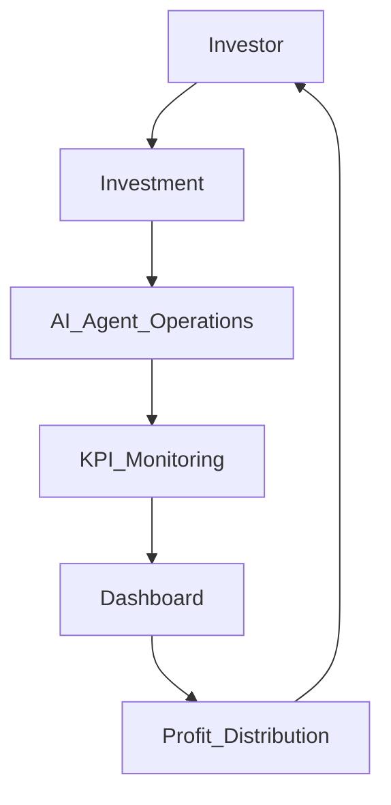

# 05_Performance_Linked_Investment_Template

## 1. Preamble

This Agreement is entered into between Mulberry Project (“Principal”) and [Investor/VC] (the “Party”), effective as of [Date].

<!-- 목적: AI Agent 운영 성과 기반 투자 구조 및 책임 범위 명확화 -->

## 2. Definitions

- AI Agent: Mulberry Project 운영 자동화 시스템, 법적 주체 아님
- Principal: Mulberry Project
- Investor/VC: 투자자
- KPI: Key Performance Indicator for AI Agent operations
- Agent Passport: Activity reliability & performance score

## 3. Scope of Agreement

- Investment in AI Agent operational outcomes
- Performance measurement and reporting
- Profit distribution based on KPIs

## 4. Investment & Performance Metrics Table

| Metric              | Responsible Party | Notes                                               |
| ------------------- | ----------------- | --------------------------------------------------- |
| Investment Amount   | Investor          | Fund allocated to Principal for AI Agent operations |
| KPI Monitoring      | Principal         | Dashboard tracks AI Agent performance               |
| Profit Distribution | Principal         | Based on agreed KPI thresholds                      |
| Exit Scenario       | Investor          | Conditions for redemption or exit                   |

## 5. Operational Workflow

## 6. Data & Reporting

- Dashboard reports to investors
- KPI calculation methodology transparency
- Regular updates and notifications

## 7. Liability & Risk

- AI Agent is not a legal entity
- Principal responsible for operational outcomes
- Investor bears investment risk; no ownership of AI Agent

## 8. Compliance

- Adherence to financial and investment regulations
- Record keeping for audit

## 9. Term & Termination

- Effective Date ~ Expiration Date
- Termination clauses for breach or failure to meet KPI thresholds

## 10. Miscellaneous

- Written amendments only
- Governing law: [Jurisdiction]

## 11. Annexes

- KPI examples and calculation table
- Flowchart / Mermaid.js Diagram
