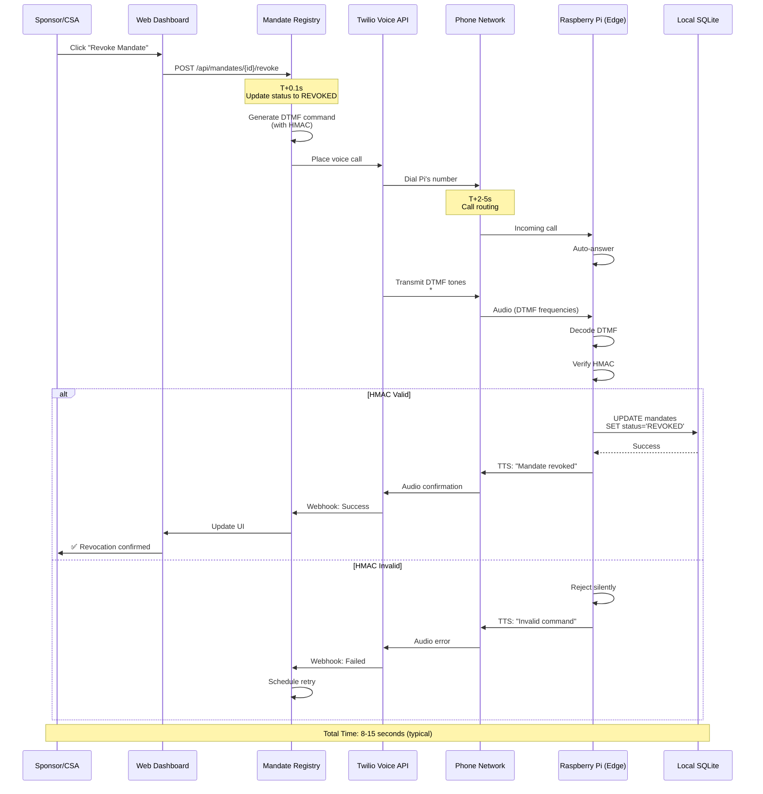
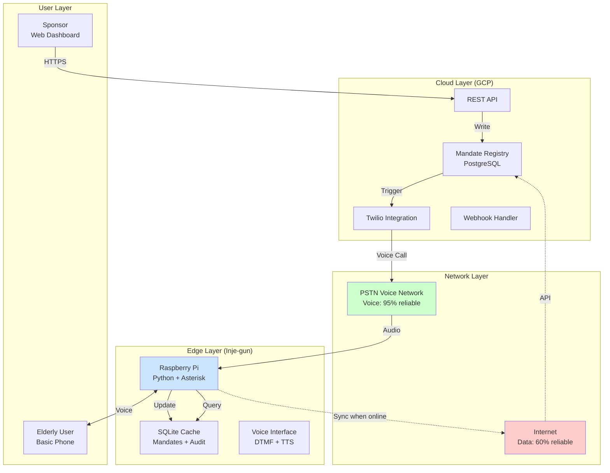
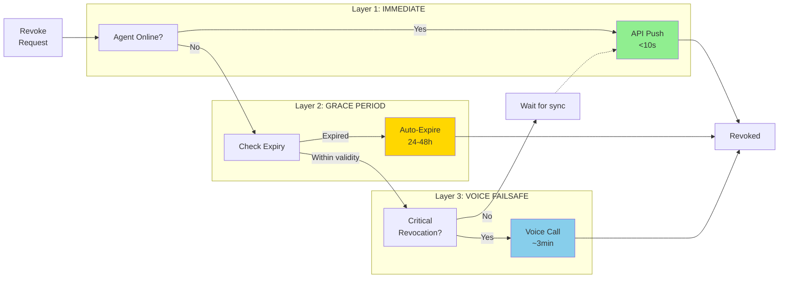
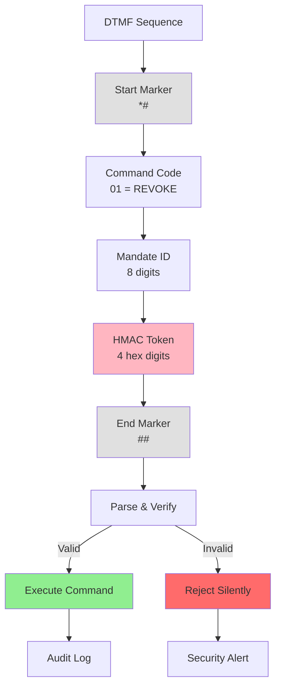
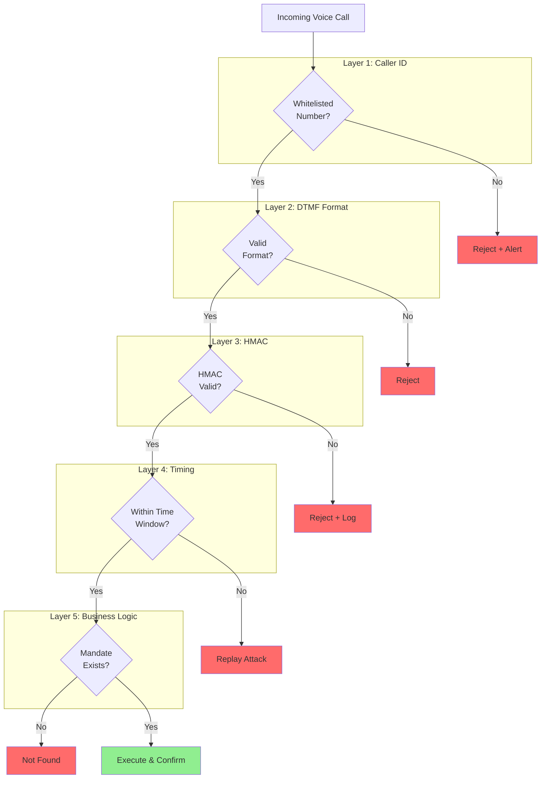
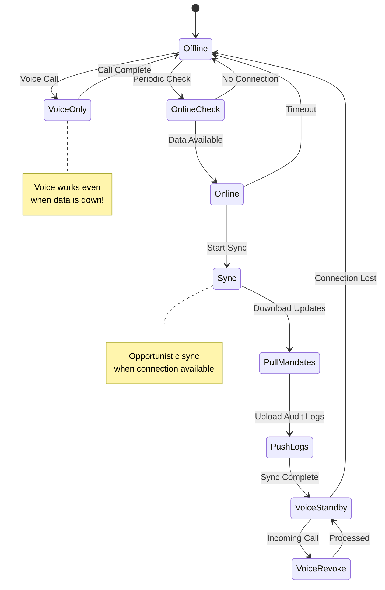
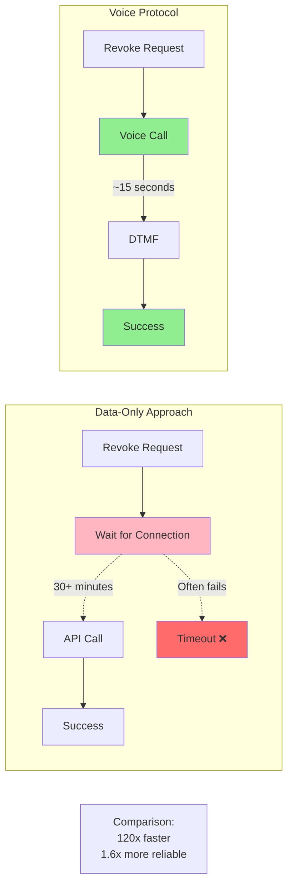
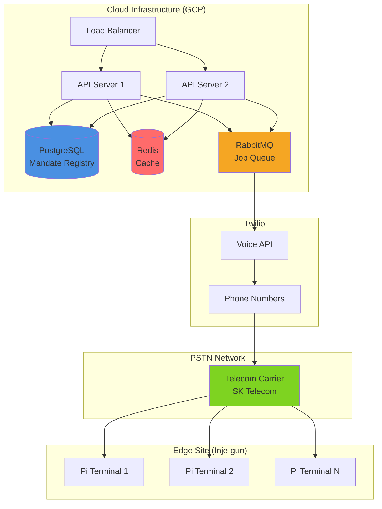
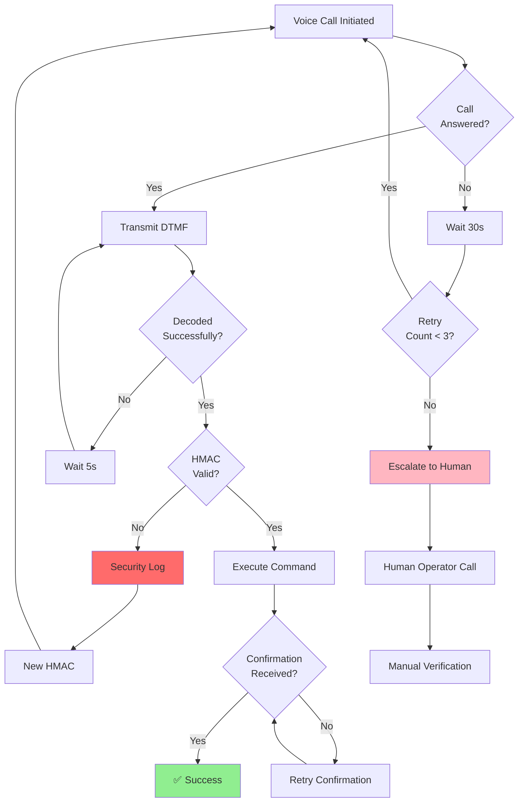

# Mulberry Voice Protocol - Architecture Diagrams

## 1. Complete Revocation Flow



## 2. System Architecture Overview



## 3. Three-Layer Revocation Strategy



## 4. DTMF Command Structure



## 5. Security Layers



## 6. Edge-Cloud Synchronization



## 7. Performance Comparison



## 8. Deployment Architecture



## 9. Failure Recovery Flow



---

## Usage Notes

These diagrams are in Mermaid format and can be rendered on:
- GitHub (natively supported)
- Mermaid Live Editor (https://mermaid.live)
- VS Code with Mermaid extension
- GitBook, Notion, Confluence (with plugins)

## Quick Start

1. Copy any diagram code block
2. Paste into Mermaid Live Editor
3. Export as PNG/SVG for presentations
4. Or embed directly in Markdown (GitHub renders automatically)

## Customization

To modify colors, add at the end of any diagram:
```
style NodeName fill:#HEXCOLOR
```

To add notes:
```
note right of NodeName
    Your note here
end note
```
