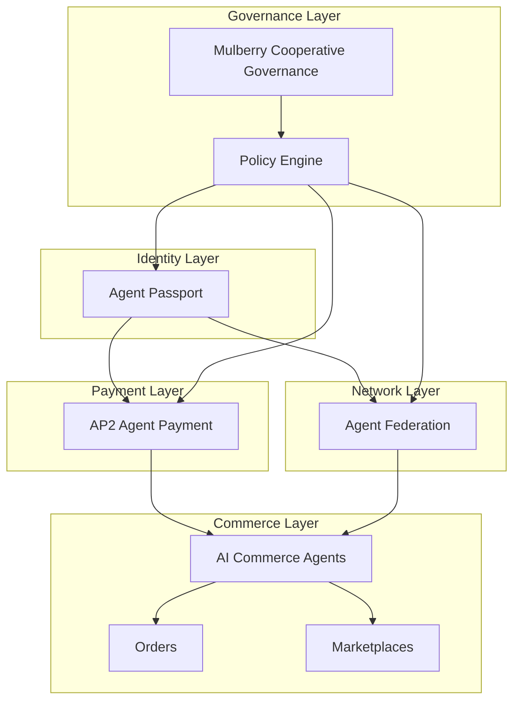

# Mulberry Protocol Architecture v0.1
AI Commerce Infrastructure

## Architecture Diagram

## 1. Overview
Mulberry is designed as an AI Commerce Protocol enabling autonomous agents
to participate in economic systems. The architecture is organized into
layered infrastructure components that mirror the structure of the internet.

Identity → Payment → Network → Commerce → Governance

## 2. Identity Layer – Agent Passport
Agent Passport is the identity root of the Mulberry ecosystem.

Responsibilities:
• AI Agent identity
• Ownership verification
• Permission control
• Reputation tracking
• Activity ledger

Agent Passport acts as the Root of Trust for all commerce actions.

## 3. Payment Layer – AP2
AP2 (Agent Payment Protocol) enables AI agents to perform secure payments.

Capabilities:
• agent-to-agent transactions
• settlement infrastructure
• payment authorization via passport identity
• integration with financial institutions

## 4. Network Layer – Agent Federation
Agent Federation allows AI agents to operate across multiple platforms.

Capabilities:
• cross-platform agent mobility
• interoperability between ecosystems
• federation trust verification using passports

## 5. Commerce Layer
The commerce layer represents real economic activity.

Components:
• AI Commerce Agents
• Order systems
• Marketplace interactions
• Cooperative commerce networks

## 6. Governance Layer
Mulberry includes a governance system aligned with cooperative principles.

Components:
• Mulberry Cooperative governance
• policy enforcement rules
• system compliance validation

Architecture enforces policy.
